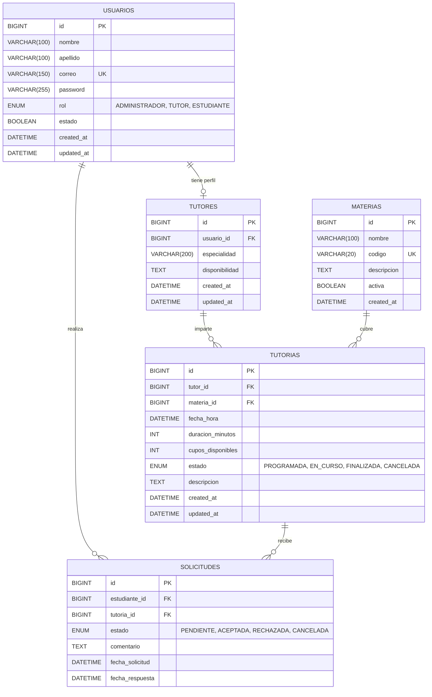

# Tutorías Backend — Entrega 3: Backend Completo + Seguridad + Postman

Backend del **Sistema de Gestión de Tutorías Universitarias (SGTU)**, desarrollado con **Spring Boot 3**, **Spring Security 6**, **JJWT**, **Spring Data JPA** y base de datos MySQL en AWS RDS. Incluye autenticación con JWT, control de acceso por roles (RBAC), documentación interactiva con **Swagger OpenAPI 3** y colección de Postman con 17 tests automatizados.

---

## 👥 Integrantes del Equipo

| Nombre | Rol |
|---|---|
| **Wadid Rivas Payares** | Encargado Backend |
| **Azael Espitia Toribio** | Encargado Base de Datos / AWS RDS |
| **Eduardo Julio Bettin Avilez** | Líder Técnico / Frontend |
| **Jhon Jader Bertel Ortega** | Encargado QA / Documentación |

---

## 🛠️ Stack Tecnológico

- **Java 17**
- **Spring Boot 3.3.13** (Web, Data JPA, Security, Validation)
- **JSON Web Tokens (JJWT 0.12.6)** — Autenticación Stateless
- **SpringDoc OpenAPI 2.6.0** — Swagger UI con Bearer JWT
- **MySQL 8** — AWS RDS
- **Maven**
- **Lombok**
- **JUnit 5 & Mockito** — 17 pruebas unitarias automatizadas

---

## 📂 Estructura Detallada del Monorepo a Nivel de Archivo

```text
SGTU-Tutorias-Universitarias/                   ← Raíz del monorepo (repositorio GitHub)
├── .gitignore                                   # Ignora target/, node_modules/, .env, .idea/
├── README.md                                    # Descripción general del monorepo
│
├── backend/                                     ← Módulo Spring Boot (este proyecto)
│   ├── pom.xml                                  # Dependencias Maven: Spring Boot, Security, JJWT, SpringDoc
│   ├── README.md                                # Documentación técnica del backend (este archivo)
│   │
│   ├── sql/
│   │   ├── ddl_tutorias.sql                     # DDL completo con tablas, FKs y usuarios de prueba (BCrypt)
│   │   └── data_seed.sql                        # INSERTs de datos iniciales (ON DUPLICATE KEY UPDATE)
│   │
│   ├── postman/
│   │   ├── SGTU-API-Entrega3.postman_collection.json  # Colección con 7 carpetas y 17 tests automatizados
│   │   └── SGTU-Local.postman_environment.json        # Variables: base_url, token_admin/tutor/estudiante
│   │
│   └── src/
│       ├── main/
│       │   ├── java/com/uas/tutorias/
│       │   │   │
│       │   │   ├── TutoriasBackendApplication.java     # Clase principal @SpringBootApplication
│       │   │   │
│       │   │   ├── config/
│       │   │   │   ├── CorsConfig.java                 # Permite orígenes desde Angular (localhost:4200)
│       │   │   │   ├── OpenApiConfig.java              # Metadata Swagger + SecurityScheme Bearer JWT
│       │   │   │   └── SecurityConfig.java             # Cadena de filtros, CSRF off, Stateless, RBAC URLs
│       │   │   │
│       │   │   ├── controller/
│       │   │   │   ├── AuthController.java             # POST /api/auth/login (público)
│       │   │   │   ├── UsuarioController.java          # CRUD /api/usuarios (@PreAuthorize por método)
│       │   │   │   ├── MateriaController.java          # CRUD /api/materias
│       │   │   │   ├── TutorController.java            # CRUD /api/tutores
│       │   │   │   ├── TutoriaController.java          # CRUD /api/tutorias + PATCH estado
│       │   │   │   └── SolicitudController.java        # CRUD /api/solicitudes + PATCH responder
│       │   │   │
│       │   │   ├── dto/
│       │   │   │   ├── request/
│       │   │   │   │   └── LoginRequest.java           # { correo, password } con validaciones @NotBlank
│       │   │   │   └── response/
│       │   │   │       └── AuthResponse.java           # { token, tipo, id, nombre, apellido, correo, rol }
│       │   │   │
│       │   │   ├── entity/
│       │   │   │   ├── Usuario.java                    # @Entity: id, nombre, apellido, correo, password (WRITE_ONLY), rol, estado
│       │   │   │   ├── Materia.java                    # @Entity: id, nombre, codigo, descripcion, activa
│       │   │   │   ├── Tutor.java                      # @Entity: id, @OneToOne Usuario, especialidad, disponibilidad
│       │   │   │   ├── Tutoria.java                    # @Entity: id, @ManyToOne Tutor, @ManyToOne Materia, fechaHora, duracion, estado, cupos
│       │   │   │   └── Solicitud.java                  # @Entity: id, @ManyToOne Usuario(estudiante), @ManyToOne Tutoria, estado, fechaSolicitud
│       │   │   │
│       │   │   ├── exception/
│       │   │   │   ├── BadRequestException.java        # HTTP 400
│       │   │   │   ├── ConflictException.java          # HTTP 409
│       │   │   │   ├── ResourceNotFoundException.java  # HTTP 404
│       │   │   │   └── GlobalExceptionHandler.java     # @RestControllerAdvice: 400, 401, 403, 404, 409, 500
│       │   │   │
│       │   │   ├── repository/
│       │   │   │   ├── UsuarioRepository.java          # findByCorreo(String correo)
│       │   │   │   ├── MateriaRepository.java          # findByActivaTrue()
│       │   │   │   ├── TutorRepository.java            # findByUsuarioId()
│       │   │   │   ├── TutoriaRepository.java          # findByEstado(), findByMateriaId()
│       │   │   │   └── SolicitudRepository.java        # findByEstudianteId(), findByTutoriaId()
│       │   │   │
│       │   │   ├── security/
│       │   │   │   ├── JwtTokenProvider.java           # Genera/firma/valida tokens HS256, extrae claims
│       │   │   │   ├── JwtAuthenticationFilter.java    # OncePerRequestFilter: extrae Bearer, valida, monta SecurityContext
│       │   │   │   ├── JwtAuthEntryPoint.java          # Responde JSON 401 (no HTML) en falla de autenticación
│       │   │   │   ├── CustomAccessDeniedHandler.java  # Responde JSON 403 (no HTML) en falla de autorización
│       │   │   │   └── UserDetailsServiceImpl.java     # Carga usuario por correo, asigna ROLE_ prefixado
│       │   │   │
│       │   │   ├── service/
│       │   │   │   ├── AuthService.java                # Interface: login(LoginRequest) → AuthResponse
│       │   │   │   ├── UsuarioService.java
│       │   │   │   ├── MateriaService.java
│       │   │   │   ├── TutorService.java
│       │   │   │   ├── TutoriaService.java
│       │   │   │   └── SolicitudService.java
│       │   │   │
│       │   │   └── service/impl/
│       │   │       ├── AuthServiceImpl.java            # AuthManager.authenticate() → lookup BD → genera JWT
│       │   │       ├── UsuarioServiceImpl.java         # BCrypt encode en crear() y actualizar()
│       │   │       ├── MateriaServiceImpl.java
│       │   │       ├── TutorServiceImpl.java
│       │   │       ├── TutoriaServiceImpl.java
│       │   │       └── SolicitudServiceImpl.java
│       │   │
│       │   └── resources/
│       │       ├── application.yml                     # Datasource, JWT secret/expiration, SpringDoc config
│       │       └── application-example.yml             # Plantilla de variables de entorno para el equipo
│       │
│       └── test/
│           └── java/com/uas/tutorias/service/
│               ├── AuthServiceTest.java                # 3 tests: login exitoso, credenciales inválidas, usuario inactivo
│               ├── UsuarioServiceTest.java             # 5 tests: crear, listar, buscarId, actualizar, eliminar
│               ├── MateriaServiceTest.java             # Tests CRUD Materia
│               ├── TutorServiceTest.java               # Tests CRUD Tutor
│               ├── TutoriaServiceTest.java             # Tests CRUD Tutoría
│               └── SolicitudServiceTest.java           # Tests CRUD Solicitud
│
├── frontend/
│   └── README.md                                # Pendiente — Angular (Entrega 4)
│
└── docs/
    ├── Entrega2_Documento.doc                   # Documento de diseño Entrega 2
    ├── Entrega3_Arquitectura_Seguridad.md       # Documento formal de arquitectura de seguridad
    └── Entrega3_Reporte_Pruebas.md              # Reporte de 34 pruebas (17 unitarias + 17 Postman)
```

---

## 🗄️ Esquema de Base de Datos y Modelos Relacionales

### Diagrama Entidad-Relación



### Relaciones entre Entidades (JPA)

| Relación | Tipo | Descripción |
|---|---|---|
| `Usuario` → `Tutor` | `@OneToOne` | Un usuario con rol TUTOR tiene exactamente un perfil de tutor |
| `Tutor` → `Tutoria` | `@OneToMany` / `@ManyToOne` | Un tutor puede impartir muchas sesiones de tutoría |
| `Materia` → `Tutoria` | `@OneToMany` / `@ManyToOne` | Una materia puede tener muchas sesiones programadas |
| `Usuario` (estudiante) → `Solicitud` | `@OneToMany` / `@ManyToOne` | Un estudiante puede enviar múltiples solicitudes |
| `Tutoria` → `Solicitud` | `@OneToMany` / `@ManyToOne` | Una tutoría puede recibir múltiples solicitudes de distintos estudiantes |

### Reglas de Integridad

- `correo` en `USUARIOS` es **UNIQUE** — no se permiten correos duplicados.
- `codigo` en `MATERIAS` es **UNIQUE** — el código de asignatura es único.
- La eliminación de un `USUARIO` con rol `TUTOR` debe eliminar o desactivar su perfil en `TUTORES`.
- Un `ESTUDIANTE` no puede solicitar la misma `TUTORIA` dos veces (validación en servicio).
- Solo se puede solicitar una `TUTORIA` cuyo estado sea `PROGRAMADA` y con `cupos_disponibles > 0`.

---

## 🔐 Seguridad y Gestión de Cuentas

### Modelo Institucional Estricto

> **No existe auto-registro público.** Todas las cuentas son creadas y administradas exclusivamente por el `ADMINISTRADOR`.

| Acción | Responsable | Endpoint |
|---|---|---|
| Crear cuenta de Tutor | `ADMINISTRADOR` | `POST /api/usuarios` (rol: TUTOR) |
| Crear cuenta de Estudiante | `ADMINISTRADOR` | `POST /api/usuarios` (rol: ESTUDIANTE) |
| Crear otro Administrador | `ADMINISTRADOR` | `POST /api/usuarios` (rol: ADMINISTRADOR) |
| Activar / desactivar cuenta | `ADMINISTRADOR` | `PATCH /api/usuarios/{id}/estado` |
| Iniciar sesión | Todos los roles | `POST /api/auth/login` |

### Flujo de Autenticación Completo

```
┌─────────────┐         ┌───────────────┐         ┌─────────────────┐
│  ADMIN      │         │  API Backend  │         │  Base de Datos  │
│  (Postman)  │         │  (Spring Boot)│         │  (MySQL RDS)    │
└──────┬──────┘         └───────┬───────┘         └────────┬────────┘
       │                        │                          │
       │  POST /api/auth/login  │                          │
       │  { correo, password }  │                          │
       │───────────────────────►│                          │
       │                        │  findByCorreo(correo)    │
       │                        │─────────────────────────►│
       │                        │◄─────────────────────────│
       │                        │  BCrypt.matches(pw, hash)│
       │                        │  Genera JWT (HS256)      │
       │  { token, rol, ... }   │                          │
       │◄───────────────────────│                          │
       │                        │                          │
       │  POST /api/usuarios    │                          │
       │  Bearer: <token_admin> │                          │
       │  { nombre, correo,     │                          │
       │    password, rol:TUTOR}│                          │
       │───────────────────────►│                          │
       │                        │  JwtAuthFilter valida    │
       │                        │  @PreAuthorize(ADMIN)    │
       │                        │  BCrypt.encode(password) │
       │                        │─────────────────────────►│
       │  201 Created           │                          │
       │◄───────────────────────│                          │
       │                        │                          │
       │  (El tutor ya puede hacer login con sus credenciales)
```

### Componentes de Seguridad

| Componente | Clase | Responsabilidad |
|---|---|---|
| Cadena de filtros | `SecurityConfig` | CSRF off, Stateless, CORS, reglas de URL por rol |
| Filtro JWT | `JwtAuthenticationFilter` | Extrae `Bearer <token>`, valida firma y expiración, monta `SecurityContextHolder` |
| Proveedor JWT | `JwtTokenProvider` | Genera, firma (HS256) y valida tokens; extrae claims (`userId`, `role`, `nombre`) |
| Carga de usuario | `UserDetailsServiceImpl` | Busca usuario por correo en BD, asigna `GrantedAuthority` con prefijo `ROLE_` |
| Error 401 | `JwtAuthEntryPoint` | Retorna JSON uniforme en lugar de página HTML de error |
| Error 403 | `CustomAccessDeniedHandler` | Retorna JSON uniforme en lugar de página HTML de error |
| Cifrado | `BCryptPasswordEncoder` | 10 rounds — protege contraseñas contra fuerza bruta y diccionarios |

### Ciclo de Vida del Token JWT

```
Emisión (POST /api/auth/login)
  └─► Header:  { "alg": "HS256", "typ": "JWT" }
      Payload: {
                 "sub":    "correo@tutorias.com",     ← identificador principal
                 "userId": 1,                          ← PK en BD
                 "role":   "ROLE_ADMINISTRADOR",       ← autorización RBAC
                 "nombre": "Wadid Rivas",              ← visualización en cliente
                 "iat":    <timestamp emisión>,
                 "exp":    <timestamp + 24h>           ← configurable via JWT_EXPIRATION
               }
      Firma:   HMAC-SHA256(base64(header) + "." + base64(payload), JWT_SECRET)

Uso (peticiones autenticadas)
  └─► Header HTTP: Authorization: Bearer <token>
      JwtAuthenticationFilter lo intercepta → valida → monta SecurityContextHolder

Expiración / Invalidación
  └─► El token expira en 24 horas (86400000 ms por defecto)
      No existe blacklist — el cliente debe descartar el token al cerrar sesión
```

### Respuestas de Error Estandarizadas

```json
// 401 Unauthorized — token ausente, expirado o credenciales incorrectas
{
  "timestamp": "2026-10-03T17:30:00",
  "status": 401,
  "error": "Unauthorized",
  "message": "Acceso no autorizado: credenciales inválidas o token no proporcionado / expirado",
  "path": "/api/usuarios"
}

// 403 Forbidden — rol insuficiente para la operación
{
  "timestamp": "2026-10-03T17:30:00",
  "status": 403,
  "error": "Forbidden",
  "message": "Acceso denegado: no cuenta con los permisos o rol requeridos para esta acción",
  "path": "/api/materias"
}
```

---

## 🛡️ Matriz RBAC de Permisos por Endpoint

> ✅ = Permitido &nbsp;&nbsp; ❌ = Denegado (403 Forbidden) &nbsp;&nbsp; 🔓 = Público (sin token)

### Módulo: Autenticación (`/api/auth`)

| Método | Endpoint | ADMINISTRADOR | TUTOR | ESTUDIANTE | Público |
|---|---|:---:|:---:|:---:|:---:|
| POST | `/api/auth/login` | 🔓 | 🔓 | 🔓 | 🔓 |

### Módulo: Usuarios (`/api/usuarios`)

| Método | Endpoint | ADMINISTRADOR | TUTOR | ESTUDIANTE |
|---|---|:---:|:---:|:---:|
| GET | `/api/usuarios` | ✅ | ❌ | ❌ |
| GET | `/api/usuarios/{id}` | ✅ | ✅ | ✅ |
| POST | `/api/usuarios` | ✅ | ❌ | ❌ |
| PUT | `/api/usuarios/{id}` | ✅ | ❌ | ❌ |
| PATCH | `/api/usuarios/{id}/estado` | ✅ | ❌ | ❌ |
| DELETE | `/api/usuarios/{id}` | ✅ | ❌ | ❌ |

### Módulo: Materias (`/api/materias`)

| Método | Endpoint | ADMINISTRADOR | TUTOR | ESTUDIANTE |
|---|---|:---:|:---:|:---:|
| GET | `/api/materias` | ✅ | ✅ | ✅ |
| GET | `/api/materias/{id}` | ✅ | ✅ | ✅ |
| POST | `/api/materias` | ✅ | ❌ | ❌ |
| PUT | `/api/materias/{id}` | ✅ | ❌ | ❌ |
| DELETE | `/api/materias/{id}` | ✅ | ❌ | ❌ |

### Módulo: Tutores (`/api/tutores`)

| Método | Endpoint | ADMINISTRADOR | TUTOR | ESTUDIANTE |
|---|---|:---:|:---:|:---:|
| GET | `/api/tutores` | ✅ | ✅ | ✅ |
| GET | `/api/tutores/{id}` | ✅ | ✅ | ✅ |
| POST | `/api/tutores` | ✅ | ❌ | ❌ |
| PUT | `/api/tutores/{id}` | ✅ | ✅ | ❌ |
| DELETE | `/api/tutores/{id}` | ✅ | ❌ | ❌ |

### Módulo: Tutorías (`/api/tutorias`)

| Método | Endpoint | ADMINISTRADOR | TUTOR | ESTUDIANTE |
|---|---|:---:|:---:|:---:|
| GET | `/api/tutorias` | ✅ | ✅ | ✅ |
| GET | `/api/tutorias/{id}` | ✅ | ✅ | ✅ |
| POST | `/api/tutorias` | ✅ | ✅ | ❌ |
| PUT | `/api/tutorias/{id}` | ✅ | ✅ | ❌ |
| PATCH | `/api/tutorias/{id}/estado` | ✅ | ✅ | ❌ |
| DELETE | `/api/tutorias/{id}` | ✅ | ✅ | ❌ |

### Módulo: Solicitudes (`/api/solicitudes`)

| Método | Endpoint | ADMINISTRADOR | TUTOR | ESTUDIANTE |
|---|---|:---:|:---:|:---:|
| GET | `/api/solicitudes` | ✅ | ✅ | ✅ |
| GET | `/api/solicitudes/{id}` | ✅ | ✅ | ✅ |
| POST | `/api/solicitudes` | ❌ | ❌ | ✅ |
| PATCH | `/api/solicitudes/{id}/responder` | ✅ | ✅ | ❌ |
| DELETE | `/api/solicitudes/{id}` | ✅ | ❌ | ✅ |

### Módulo: Documentación (Swagger)

| Método | Endpoint | ADMINISTRADOR | TUTOR | ESTUDIANTE | Público |
|---|---|:---:|:---:|:---:|:---:|
| GET | `/swagger-ui/**` | 🔓 | 🔓 | 🔓 | 🔓 |
| GET | `/v3/api-docs/**` | 🔓 | 🔓 | 🔓 | 🔓 |

---

## ⚙️ Configuración y Variables de Entorno

La conexión a la base de datos y la clave de firma JWT se gestionan mediante variables de entorno:

### Windows (PowerShell):
```powershell
$env:DB_HOST="tu-instancia.xxxxxxxxxx.us-east-1.rds.amazonaws.com"
$env:DB_PORT="3306"
$env:DB_NAME="tutorias_db"
$env:DB_USERNAME="admin"
$env:DB_PASSWORD="tu_password_segura"
$env:SERVER_PORT="8080"
$env:JWT_SECRET="SGTUTutoriasUniversitariasSecretKey2026SecureHashKeyMustBeLongEnoughForHS256Algorithm"
$env:JWT_EXPIRATION="86400000"
```

### Linux / macOS / Bash:
```bash
export DB_HOST=tu-instancia.xxxxxxxxxx.us-east-1.rds.amazonaws.com
export DB_PORT=3306
export DB_NAME=tutorias_db
export DB_USERNAME=admin
export DB_PASSWORD=tu_password_segura
export SERVER_PORT=8080
export JWT_SECRET=SGTUTutoriasUniversitariasSecretKey2026SecureHashKeyMustBeLongEnoughForHS256Algorithm
export JWT_EXPIRATION=86400000
```

---

## 🔑 Credenciales de Prueba

Las contraseñas están almacenadas con hash BCrypt (10 rounds) en la base de datos. Usa el archivo `sql/data_seed.sql` para cargar los datos iniciales.

| Rol | Correo Electrónico | Contraseña |
|---|---|---|
| **ADMINISTRADOR** | `admin@tutorias.com` | `Admin123*` |
| **TUTOR** | `wadid.tutor@tutorias.com` | `Tutor123*` |
| **ESTUDIANTE** | `eduardo.estudiante@tutorias.com` | `Estudiante123*` |

---

## 🚀 Compilación y Ejecución

### 1. Cargar la base de datos
```sql
-- Ejecutar en MySQL (AWS RDS o local):
source sql/ddl_tutorias.sql;
source sql/data_seed.sql;
```

### 2. Ejecutar Pruebas Unitarias
```powershell
mvn test
```
*Ejecuta los 17 tests unitarios de las capas de servicio y autenticación sin requerir conexión a base de datos.*

### 3. Iniciar el Servidor Backend
```powershell
mvn spring-boot:run
```
La API estará disponible en `http://localhost:8080`.

---

## 📖 Documentación Interactiva (Swagger OpenAPI 3)

Una vez iniciado el servidor, accede a:
👉 **`http://localhost:8080/swagger-ui/index.html`**

1. Usa el endpoint `POST /api/auth/login` para autenticarte.
2. Copia el token JWT de la respuesta.
3. Haz clic en el botón verde **"Authorize"** en la parte superior derecha.
4. Ingresa `Bearer <tu_token>` y prueba todos los endpoints directamente desde tu navegador.

---

## 🧪 Pruebas con Postman (17 Tests Automatizados)

1. Abre **Postman**.
2. Importa la colección `backend/postman/SGTU-API-Entrega3.postman_collection.json`.
3. Importa el entorno `backend/postman/SGTU-Local.postman_environment.json` y selecciónalo.
4. Ejecuta las peticiones de `00. Autenticación (Login)`. Los scripts extraerán y guardarán automáticamente los tokens en las variables `{{token_admin}}`, `{{token_tutor}}` y `{{token_estudiante}}`.
5. Ejecuta la colección completa con el **Collection Runner** para verificar la aprobación de los 17 tests automatizados.

---

## 📄 Documentación Adicional

| Documento | Ubicación | Descripción |
|---|---|---|
| Arquitectura de Seguridad | `docs/Entrega3_Arquitectura_Seguridad.md` | Flujo de componentes, JWT, manejo de errores |
| Reporte de Pruebas | `docs/Entrega3_Reporte_Pruebas.md` | Detalle de 34 pruebas (17 unitarias + 17 Postman) |
| DDL Base de Datos | `backend/sql/ddl_tutorias.sql` | Script completo de creación de tablas |
| Datos Iniciales | `backend/sql/data_seed.sql` | Semilla de usuarios, materias y sesiones |
